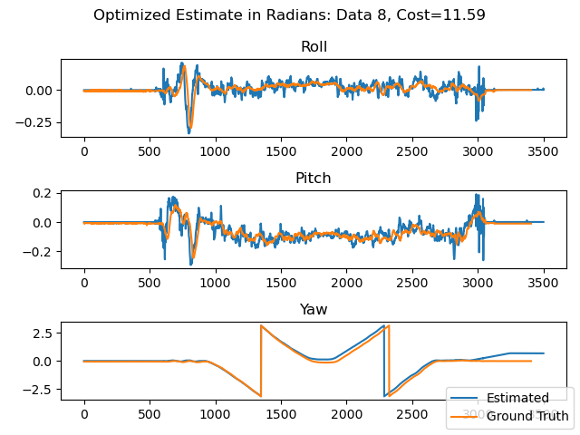
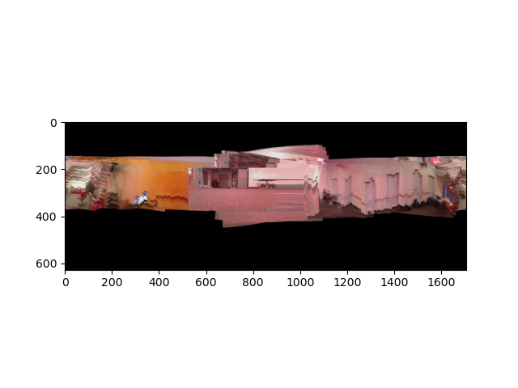
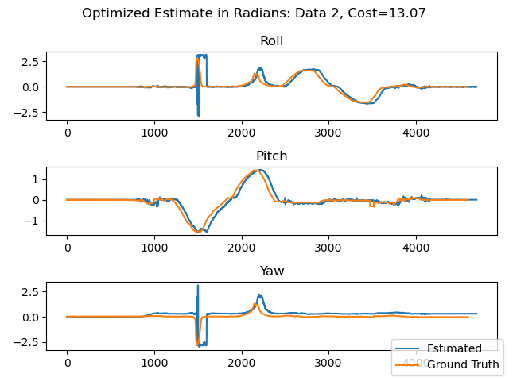
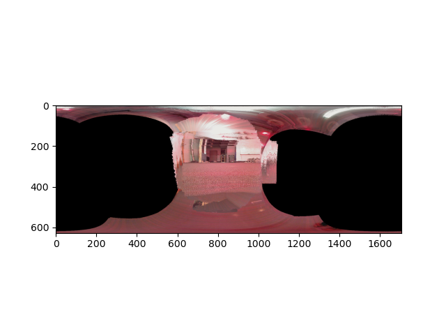

# Orientation Tracking And Image Reconstruction

# Overview
This project utilizes IMU linear acceleration and rotational velocity to estimate the orientation of a rotating body with a static position through constrained optimization. Then combines the estimated rotation with camera image data to create a panorama of the environment.

# Implementation
This was implemented in Python using NumPy and JAX. The code has been redacted, if you wish to see it, you may contact me at charles.lychee@gmail.com

# Results





# Mathematical Approach
## Variables
### State
```math
\text{Orientation of Body}: \mathbf{q}_t \in \mathbb{H}_*
```
### Control
```math
\text{Angular Velocity}: \mathbf{\omega}_t \in \mathbb{R}^3
```
### Observation
```math
\text{Linear Velocity}: \mathbf{a}_t \in \mathbb{R}^3
```

## Models
### Kinematics/Motion Model
```math
\mathbf{q}_{t+1} = f(\mathbf{q}_t, \tau_t, \mathbf{\omega}_t) := \mathbf{q}_t \circ \exp \left([0, \tau_t \mathbf{\omega}_t/2] \right)
```

### Observation/Measurement Model
We expect gravity in the body frame to be equal to linear acceleration, under the assumption of a body with static position.
```math
\mathbf{a}_t = h(\mathbf{q}_t) := \mathbf{q}_t^{-1} \circ [0, 0, -g] \circ \mathbf{q}_t
```

## Optimization
We define the error of our orientation estimates as:
```math
c(\mathbf{q}_{1:T}) = \frac{1}{2} \sum_{t=0}^{T-1} || 2\log(\mathbf{q}_{t+1}^{-1} \circ f(\mathbf{q}_t, \tau_t, \mathbf{\omega_t})) ||^2_2 + \frac{1}{2}\sum_{t=1}^T ||\mathbf{a}_t - h(\mathbf{q}_t)||^2_2
```

This represents the difference between a given orientation and our expected orientation by the motion model and the difference between a given linear acceleration and the expected linear acceleration by the observation model.

Our goal is to find the orientations that minimize this cost.
```math
\mathbf{q}_{1:T}^* = \min_{\mathbf{q}_{1:T}} c(\mathbf{q}_{1:T}) : ||\mathbf{q}_t||_2 = 1, \forall t \in \{1, 2, ..., T\}
```

This can be solved by projected gradient descent:
$$\text{Projection}: \mathbf{\Pi}(\mathbf{q}) = \frac{\mathbf{q}}{||\mathbf{q}||_2}$$
$$\mathbf{q}_{1:T}^{(k+1)} \leftarrow \mathbf{\Pi}\left(\mathbf{q}_{1:T}^{(k)} - \alpha \nabla c(\mathbf{q}_{1:T}^{(k)})\right)$$

## Image Reconstruction
We make the assumption that a given image lies on a sphere of radius 1 meter away from the rotating body. We also assume that the camera has a 60 degree horizontal and 45 degree field of view.

With these assumptions, we can project every pixel in the image onto a 3D sphere. Then we can inscribe the sphere into a cylinder with radius 1 meter and height 2 meters and project the pixels on the sphere onto the cylinder. Then, we unwrap the cylinder to result with our rectangular panorama.